## **1.基础知识** 

### 1.1、分布式理论

**什么是分布式系统？** 

在《分布式系统原理与范型》一书中有如下定义：“分布式系统是若干独立计算机的集合，这些计算机对于用户来说就像单个相关系统”； 

分布式系统是由一组通过网络进行通信、为了完成共同的任务而协调工作的计算机节点组成的系统。分布式系统的出现是为了用廉价的、普通的机器完成单个计算机无法完成的计算、存储任务。其目的是**利用更多的机器，处理更多的数据**。 

分布式系统（distributed system）是建立在网络之上的软件系统。 

首先需要明确的是，只有当单个节点的处理能力无法满足日益增长的计算、存储任务的时候，且硬件的提升（加内存、加磁盘、使用更好的CPU）高昂到得不偿失的时候，应用程序也不能进一步优化的时候，我们才需要考虑分布式系统。因为，分布式系统要解决的问题本身就是和单机系统一样的，而由于分布式系统多节点、通过网络通信的拓扑结构，会引入很多单机系统没有的问题，为了解决这些问题又会引入更多的机制、协议，带来更多的问题。。。 

**Dubbo** 

随着互联网的发展，网站应用的规模不断扩大，常规的垂直应用架构已无法应对，分布式服务架构以及流动计算架构势在必行，急需**一个治理系统**确保架构有条不紊的演进。

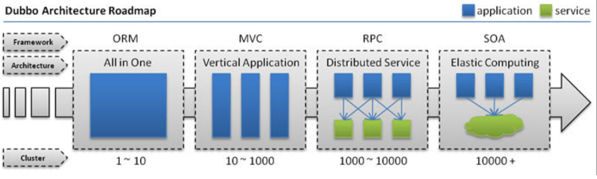

**单一应用架构**

当网站流量很小时，只需一个应用，将所有功能都部署在一起，以减少部署节点和成本。此时，用于简化增删改查工作量的数据访问框架(ORM)是关键。

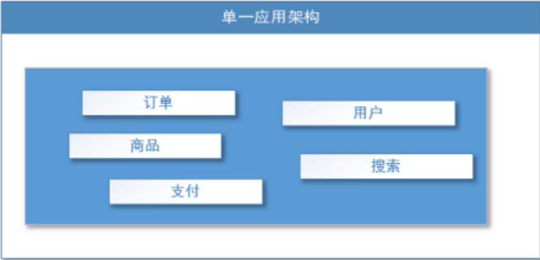

适用于小型网站，小型管理系统，将所有功能都部署到一个功能里，简单易用。 

**缺点：** 

1、性能扩展比较难 

2、带来协同开发问题 

3、不利于升级维护

**垂直应用架构**

当访问量逐渐增大，单一应用增加机器带来的加速度越来越小，将应用拆成互不相干的几个应用，以提升效率。此时，用于加速前端页面开发的Web框架(MVC)是关键。

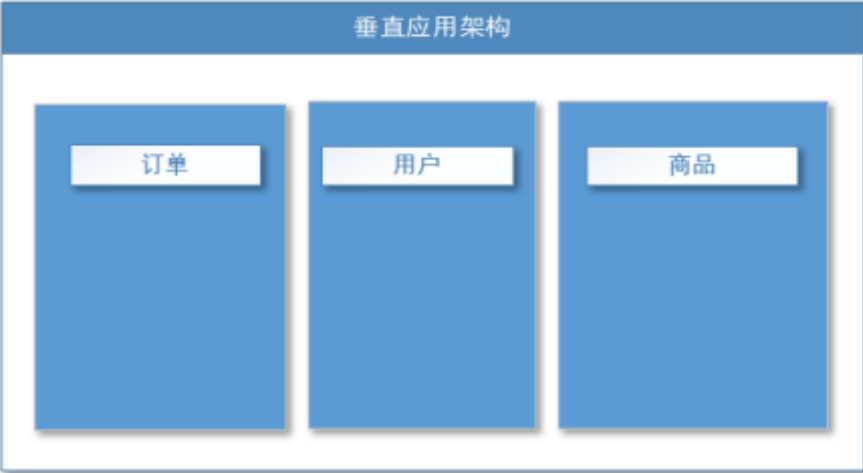

通过切分业务来实现各个模块独立部署，降低了维护和部署的难度，团队各司其职更易管理，性能扩展也更方便，更有针对性。 

缺点： 公用模块无法重复利用，开发性的浪费

**分布式服务架构**

当垂直应用越来越多，应用之间交互不可避免，将核心业务抽取出来，作为独立的服务，逐渐形成稳定的服务中心，使前端应用能更快速的响应多变的市场需求。此时，用于提高业务复用及整合的**分布式服**

**务框架(RPC)**是关键。 

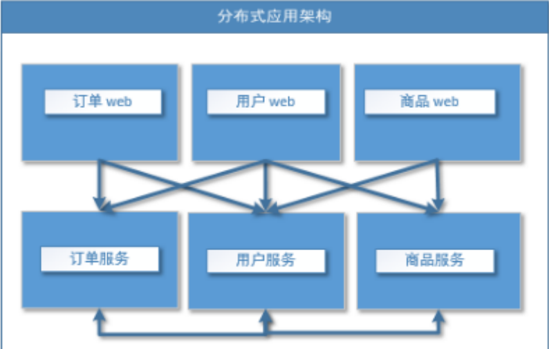

**流动计算架构**

当服务越来越多，容量的评估，小服务资源的浪费等问题逐渐显现，此时需增加一个调度中心基于访问压力实时管理集群容量，提高集群利用率。此时，用于**提高机器利用率的资源调度和治理中心( SOA ) [ Service Oriented Architecture]是关键**。

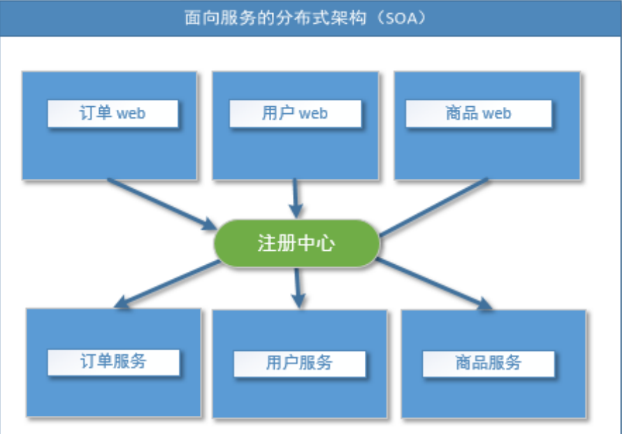

### 1.2、什么是RPC？

RPC【Remote Procedure Call】是指**远程过程调用**，是一种进程间通信方式，他是一种技术的思想，而不是规范。

它允许程序调用另一个地址空间（通常是共享网络的另一台机器上）的过程或函数，而不用 程序员显式编码这个远程调用的细节。即程序员无论是调用本地的还是远程的函数，本质上编写的调用 代码基本相同。 

也就是说两台服务器A，B，一个应用部署在A服务器上，想要调用B服务器上应用提供的函数/方法，由于不在一个内存空间，不能直接调用，需要通过网络来表达调用的语义和传达调用的数据。

为什么要用 RPC呢？就是无法在一个进程内，甚至一个计算机内通过本地调用的方式完成的需求，比如不同的系统间的通讯，甚至不同的组织间的通讯，由于计算能力需要横向扩展，需要在多台机器组成的集群上部署应用。RPC就是要像调用本地的函数一样去调远程函数； 

**RPC基本原理**

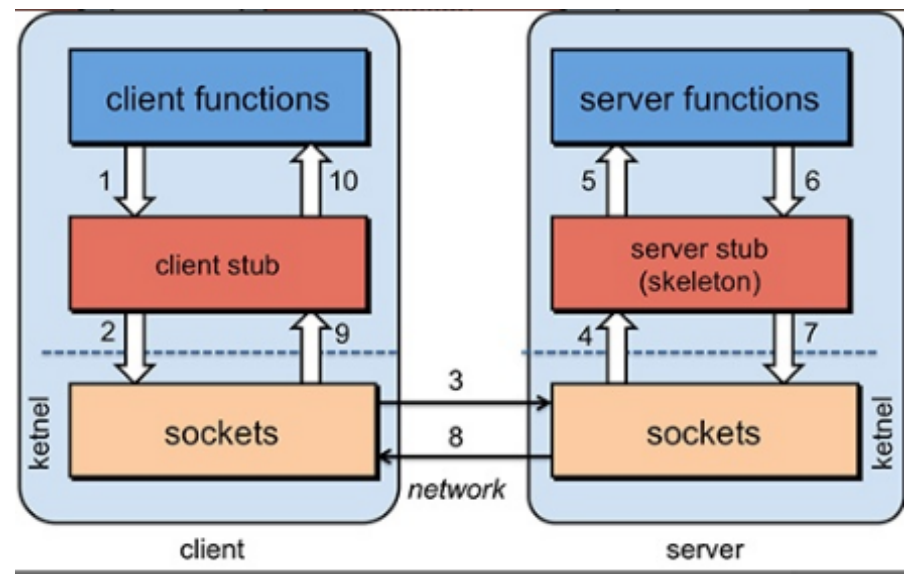

**步骤解析：**

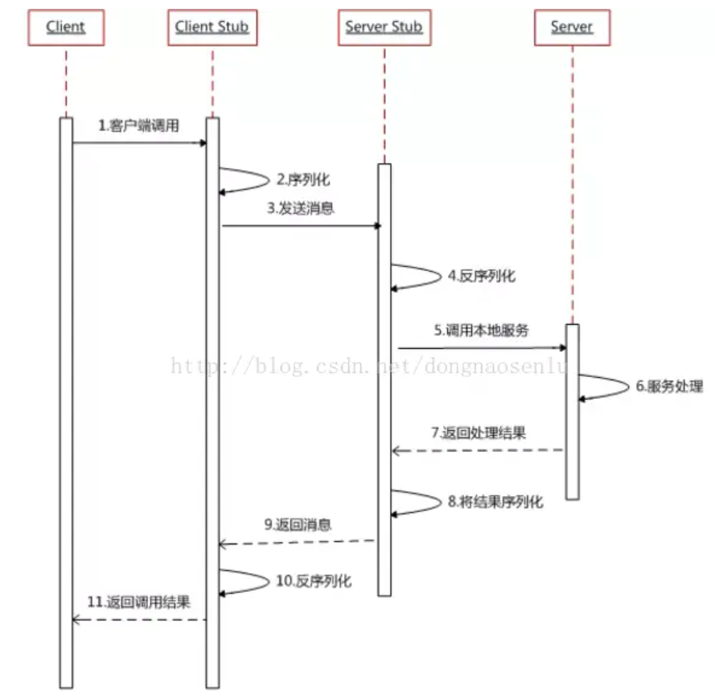

RPC两个核心模块：**通讯，序列化**。

推荐阅读：

如何给老婆解释什么是RPC：https://www.jianshu.com/p/2accc2840a1b

RPC简介及框架选择：https://www.jianshu.com/p/b0343bfd216e

从原理到选型，一文带你搞懂RPC：https://mp.weixin.qq.com/s/ll4nUVB28KpyTMS93xAckQ


## 2.Dubbo

### 2.1、什么是dubbo？

Apache Dubbo |ˈdʌbəʊ| 是一款高性能、轻量级的开源 Java RPC框架，它提供了三大核心能力：面向接口的远程方法调用，智能容错和负载均衡，以及服务自动注册和发现。

官网：https://dubbo.apache.org/zh/

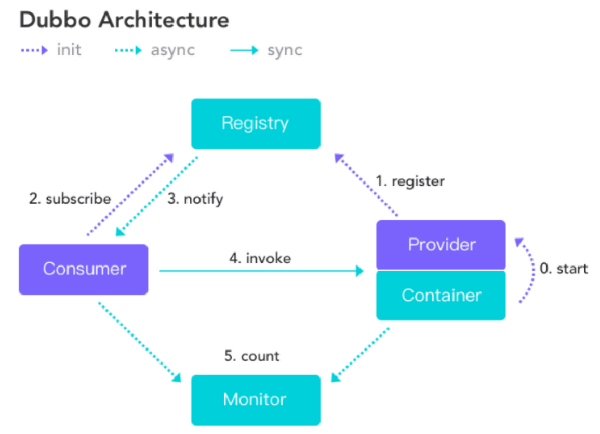

**服务提供者（Provider）**：暴露服务的服务提供方，服务提供者在启动时，向注册中心注册自己提供的服务。 

**服务消费者（Consumer）**: 调用远程服务的服务消费方，服务消费者在启动时，向注册中心订阅自己所需的服务，服务消费者，从提供者地址列表中，基于软负载均衡算法，选一台提供者进行调用，如果调用失败，再选另一台调用。 

**注册中心（Registry）**：注册中心返回服务提供者地址列表给消费者，如果有变更，注册中心将基于长连接推送变更数据给消费者 。

**监控中心（Monitor）**：服务消费者和提供者，在内存中累计调用次数和调用时间，定时每分钟发送一次统计数据到监控中心 。

**调用关系说明** 

1、服务容器负责启动，加载，运行服务提供者。 

2、服务提供者在启动时，向注册中心注册自己提供的服务。 

3、服务消费者在启动时，向注册中心订阅自己所需的服务。 

4、注册中心返回服务提供者地址列表给消费者，如果有变更，注册中心将基于长连接推送变更数据给消费者。 

5、服务消费者，从提供者地址列表中，基于软负载均衡算法，选一台提供者进行调用，如果调用失败，再选另一台调用。 

6、服务消费者和提供者，在内存中累计调用次数和调用时间，定时每分钟发送一次统计数据到监控中心。

**Dubbo注册中心**

对于服务提供方，它需要发布服务，而且由于应用系统的复杂性，服务的数量、类型也不断膨胀；
对于服务消费方，它最关心如何获取到它所需要的服务，而面对复杂的应用系统，需要管理大量的服务调用。
而且，对于服务提供方和服务消费方来说，他们还有可能兼具这两种角色，即既需要提供服务，有需要消费服务。

通过将服务统一管理起来，可以有效地优化内部应用对服务发布/使用的流程和管理。服务注册中心可以通过特定协议来完成服务对外的统一。

Dubbo提供的注册中心有如下几种类型可供选择：

- Multicast注册中心
- Zookeeper注册中心
- Redis注册中心
- Simple注册中心


### 2.2、Dubbo环境搭建

点进dubbo官方文档，推荐我们使用Zookeeper 注册中心。

**什么是Zookeeper？**

> Zookeeper是一个分布式的服务框架，是树型的目录服务的数据存储，能做到集群管理数据 ，这里能很好的作为Dubbo服务的注册中心。
>
> Dubbo能与Zookeeper做到集群部署，当提供者出现断电等异常停机时，Zookeeper注册中心能自动删除提供者信息，当提供者重启时，能自动恢复注册数据，以及订阅请求。

可参考菜鸟教程：https://www.runoob.com/w3cnote/zookeeper-tutorial.html

### 2.3、window下安装zookeeper

1、下载 zookeeper ：[地址](https://archive.apache.org/dist/zookeeper/zookeeper-3.8.0/)， 版本是3.8.0 ， 解压 zookeeper 

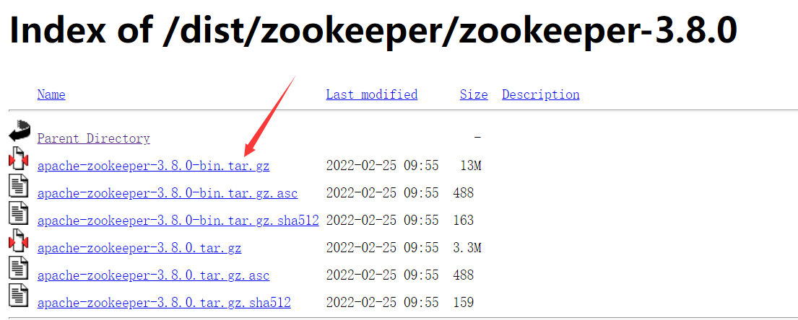

2、运行 /bin/zkServer.cmd ，初次运行会报错，没有zoo.cfg配置文件； 

可能遇到问题：闪退 ! 

解决方案：编辑 zkServer.cmd文件末尾添加 pause 。这样运行出错就不会退出，会提示错误信息， 
方便找到原因。

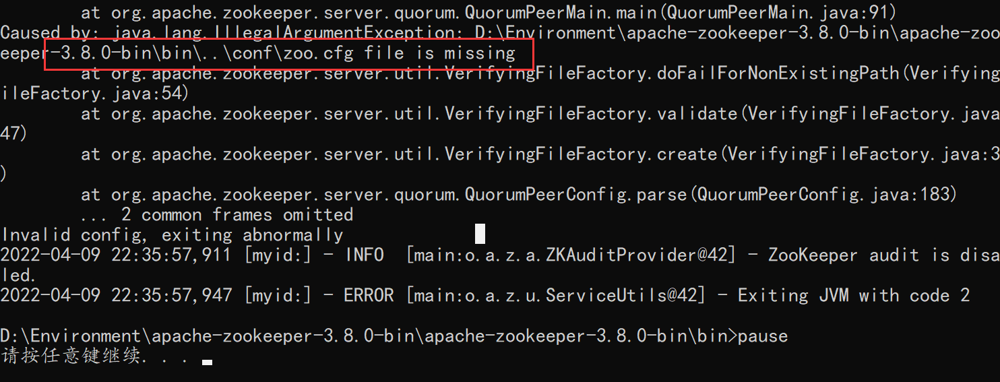

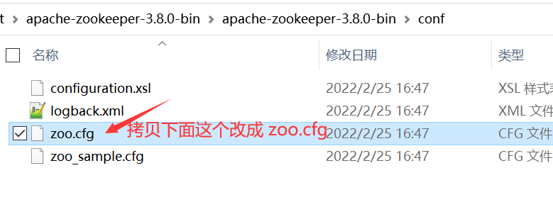

注意几个重要位置： 

dataDir=/tmp/zookeeper   临时数据存储的目录（可写相对路径） 

clientPort=2181  zookeeper的客户端端口号 

因为新版 zookeeper 3.6 之后的版本，开启服务器，zk会自动占用 8080 端口，而后端服务器大部分都需要使用8080端口，所以在 zoo.cfg 文件后加入以下配置：

```properties
# admin.serverPort 默认占8080端口
admin.serverPort=8888
```

修改完成后再次点击  zkServer.cmd 启动 zookeeper 服务

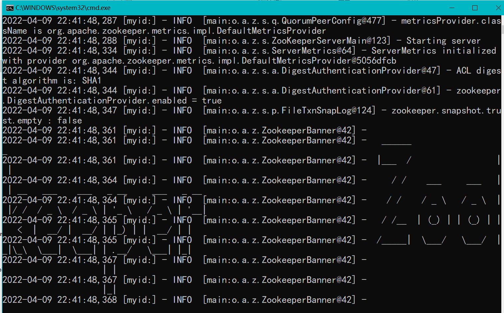

开启客户端：

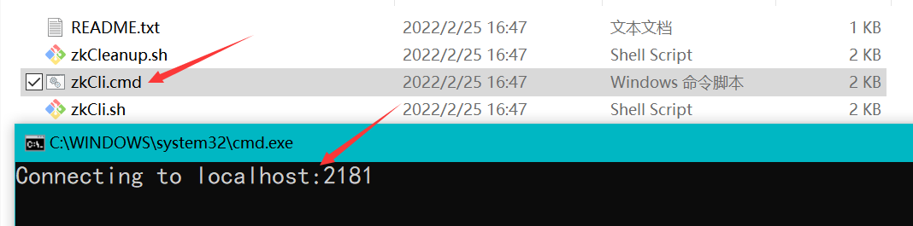

查看节点：

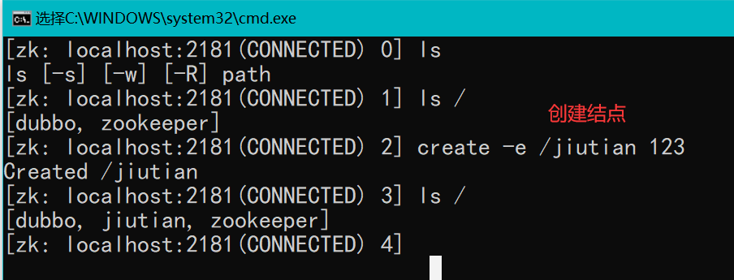

### 2.4、window下安装dubbo-admin

dubbo本身并不是一个服务软件。它其实就是一个jar包，能够帮你的java程序连接到zookeeper，并利用zookeeper消费、提供服务。 

但是为了让用户更好的管理监控众多的dubbo服务，官方提供了一个可视化的监控程序dubbo-admin，不过这个监控即使不装也不影响使用。 

**1、下载dubbo-admin**

地址：https://github.com/apache/dubbo-admin/tree/master

**2、解压进入目录**

提示：新版的项目是前后端分离

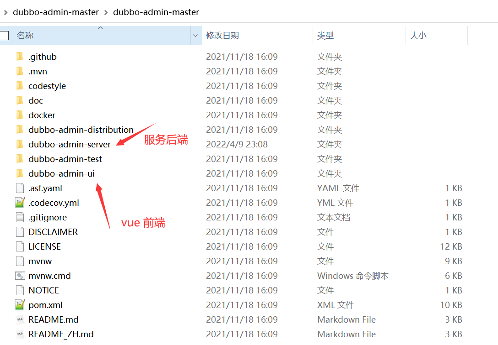

查看 dubbo-admin\src\main\resources \application.properties 指定 zookeeper地址

```properties

admin.registry.address=zookeeper://127.0.0.1:2181
admin.config-center=zookeeper://127.0.0.1:2181
admin.metadata-report.address=zookeeper://127.0.0.1:2181


admin.root.user.name=root
admin.root.user.password=root

#dubbo config
dubbo.application.name=dubbo-admin
dubbo.registry.address=${admin.registry.address}
```

**3、在项目目录下打包**

```bash
mvn clean package -Dmaven.test.skip=true
```

打包成功如图：

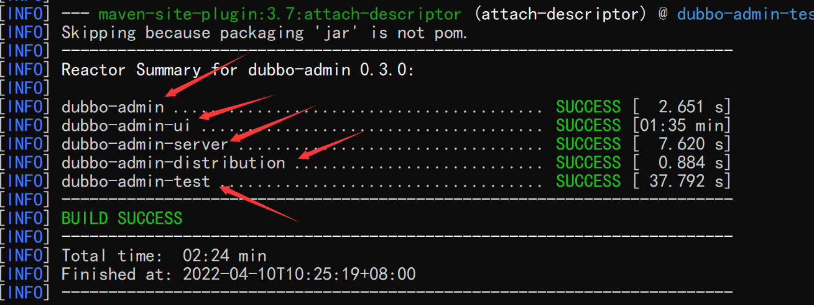


**4、开启服务端 dubbo-admin-server  (记得开启 zookeeper 服务)**

- `mvn --projects dubbo-admin-server spring-boot:run`   
  或者   
- `cd dubbo-admin-distribution/target; java -jar dubbo-admin-0.1.jar`

访问 http://localhost:8080

**5、开启前端 dubbo-admin-ui**

- `npm install`
- `npm run dev`

访问 http://localhost:8082   账号：root   密码：root

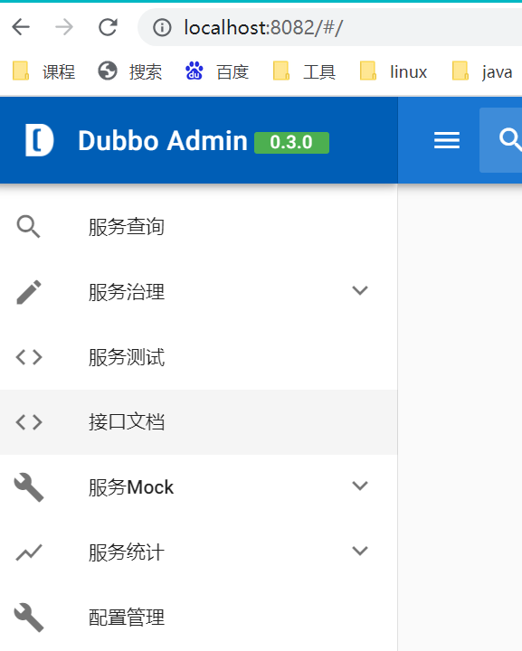

## 3、SpringBoot + Dubbo + zookeeper

项目源码：

### 3.1、框架搭建

1. IDEA 创建一个空项目

2. 先创建一个公共模块：**dubbo-springboot-common**

   创建实体类：

   ```java
   @Data
   @AllArgsConstructor
   @NoArgsConstructor
   @Accessors(chain = true)
   public class Ticket implements Serializable {
       private Long id;
       private String name;
       private BigDecimal price;
   }
   ```

   创建服务类接口：

   比如卖票的服务

   ```java
   public interface TicketService {
       Ticket getTicket();
   }
   ```

3. 分别创建两个 SpringBoot 应用模块：**dubbo-springboot-provider**（服务提供者）、**dubbo-springboot-consumer**（消费者）

4. 分别导入相关依赖：

   ```xml
   <!-- dubbo-springBoot -->
   <dependency>
       <groupId>org.apache.dubbo</groupId>
       <artifactId>dubbo-spring-boot-starter</artifactId>
       <version>2.7.8</version>
   </dependency>
   
   <!--针对zookeeper的常见应用场景，提供了方便的 Recipes(菜谱)，帮助用户快速高效地完成代码开发。-->
   <dependency>
       <groupId>org.apache.curator</groupId>
       <artifactId>curator-recipes</artifactId>
       <version>2.13.0</version>
   </dependency>
   
   <!--公共模块-->
   <dependency>
       <groupId>com.jiutian</groupId>
       <artifactId>dubbo-springboot-common</artifactId>
       <version>0.0.1-SNAPSHOT</version>
   </dependency>
   ```

### 3.2、服务提供者

编写接口实现类：
   ```java
// 规定版本号 version，可以用版本号从早期的接口实现过渡到新的接口实现，版本号不同的服务相互间不引用
// interfaceClass，通过反射引用远程接口服务
@DubboService(version = "1.0.0",interfaceClass = TicketService.class)
public class TicketServiceImpl implements TicketService {
    @Override
    public Ticket getTicket() {
        return new Ticket(1001L,"《功夫》",new BigDecimal("150.5"));
    }
}
   ```

**提示**：这里的 **@DubboService** 注解是新版本 **dubbo** jar 包支持的，如果是旧版本的 **dubbo** jar 包应该用 **@Service** 但是要注意是 dubbo 下的 Service 注解而不是 Springboot 自带的 Service 注解。

配置 application.properties：

```properties
server.port=8001

# 当前服务应用名字
dubbo.application.name=provider-server
# 注册中心地址
dubbo.registry.address=zookeeper://127.0.0.1:2181
# 哪些服务被注册，扫描包
dubbo.scan.base-packages=com.jiutian.service

#声明 dubbo的端口号
dubbo.protocol.port = 20881
#声明dubbo的协议
dubbo.protocol.name = dubbo
```

**提示：**因为要用 dubbo-admin 来实现监控，而新版的 dubbo-admin 中集成了一个测试服务用的是 20880 端口，所以这里的 dubbo 的端口号不能再是 20880。

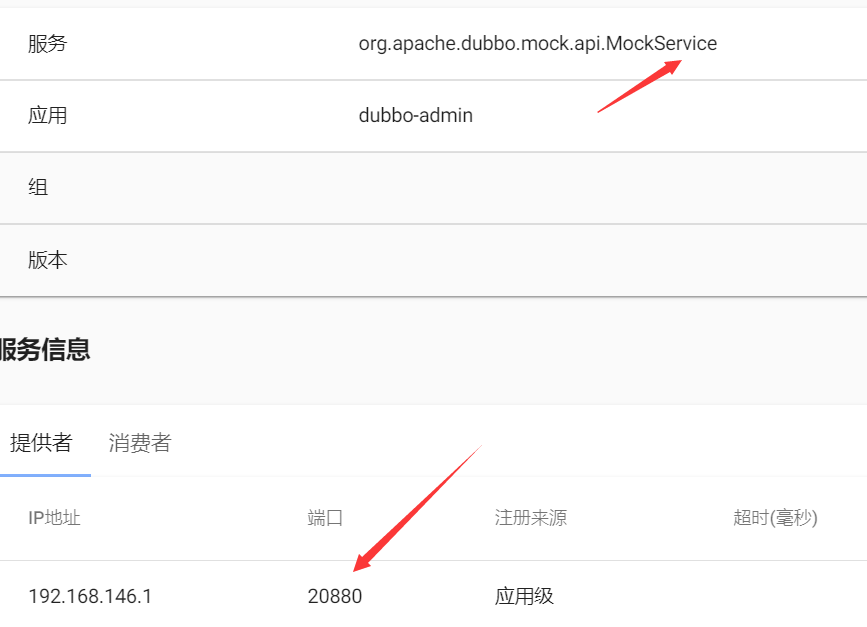

### 3.3、消费者

实现消费者买票

编写用户接口：

```java
public interface UserService {
    Ticket buyTicket();
}
```

编写用户接口实现类：

   ```java
@Service
public class UserServiceImpl implements UserService {

   /**
     * 远程引用指定的服务，他会按照全类名进行匹配，看谁给注册中心注册了这个全类名
     * 引用，Pom坐标，可以定义路径相同的接口名
     * 版本号要一致
     */
    @DubboReference(version = "1.0.0")
    private TicketService ticketService;

    @Override
    public Ticket buyTicket() {
        Ticket ticket = ticketService.getTicket();
        System.out.println(ticket.toString());
        return ticket;
    }

}
   ```

编写 UserController :

```java
@RequestMapping("/user")
@RestController
public class UserController {

    private final UserServiceImpl userService;

    @Autowired
    public UserController(UserServiceImpl userService) {
        this.userService = userService;
    }

    @RequestMapping("/getTicket")
    public Ticket getTicket(){
        return userService.buyTicket();
    }
}
```

配置 application.properties：

```properties
server.port=8002

# 消费者，暴露名字
dubbo.application.name=consumer-server
# 注册中心名字
dubbo.registry.address=zookeeper://127.0.0.1:2181
```

### 3.4、启动测试

1. 开启 Zookeeper 服务 （2181、8888）
2. 开启 dubbo-admin 监控服务
   - 开启 dubbo-admin-server (` java -jar dubbo-admin-0.3.0.jar `)  （8080、20880）
   - 开启 dubbo-admin-ui（`npm run dev`）（8082）
3. 开启 dubbo-springboot-provider 服务提供者 （8001）
4. 开启 dubbo-springboot-consumer 服务消费者 （8002）

**访问 ：**

- 服务消费者：http://localhost:8002/user/getTicket

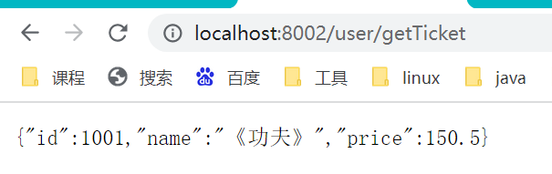

- 监控中心：http://localhost:8082/#/

  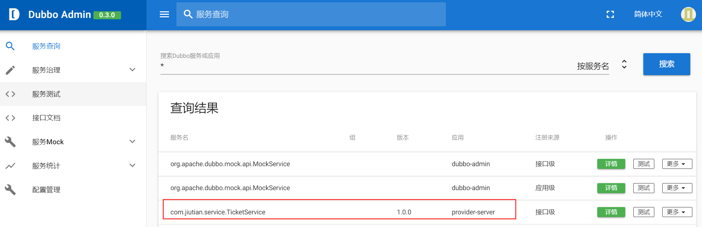